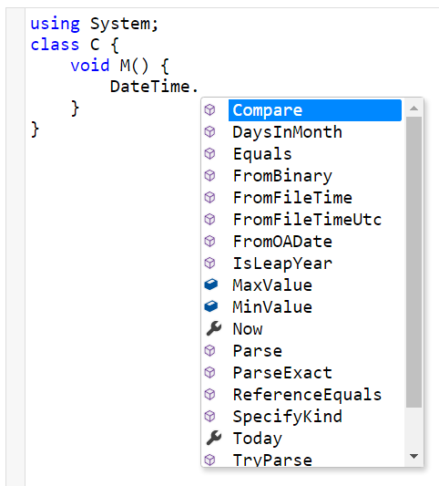
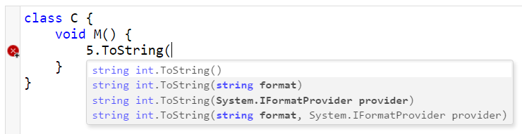
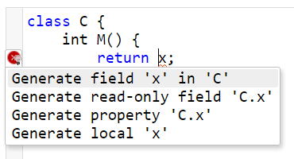
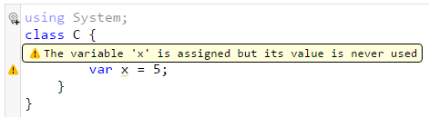

## Overview

MirrorSharp is a code editor `<textarea>` built on Roslyn and [CodeMirror](https://codemirror.net/).

### Features
#### Code completion


#### Signature help


#### Quick fixes


#### Diagnostics

  
## Usage

You'll need the following:

- **MirrorSharp.Owin** on the server (.NET Core is planned, but not supported yet)
- **mirrorsharp.js** — client library that provides the user interface

### Server

#### MirrorSharp.Owin

NuGet: `Install-Package MirrorSharp.Owin -Pre`  
Once installed, call `app.UseMirrorSharp()` in your OWIN startup.

### Client

Use one of the following:

- `npm install mirrorsharp --save`
- `bower install mirrorsharp --save` (TODO: this is not available yet)

#### CSS
If you are using LESS, CSS references can be done automatically by including `mirrorsharp/mirrorsharp.less`.  
Otherwise, make sure to include the following:

1. codemirror/lib/codemirror.css
2. codemirror/addon/lint/lint.css
3. codemirror/addon/hint/show-hint.css
4. codemirror-addon-lint-fix/addon/lint-fix/lint-fix.css
5. mirrorsharp/mirrorsharp.css

#### JS
JS can be done automatically since mirrorsharp has proper requires. Otherwise:

1. codemirror/lib/codemirror.js
2. codemirror/mode/clike/clike.js
3. codemirror/addon/lint/lint.js
4. codemirror/addon/hint/show-hint.js
5. codemirror-addon-lint-fix/addon/lint-fix/lint-fix.js
6. mirrorsharp/mirrorsharp.js

#### Usage
Once referenced, you can do the following:
```javascript
mirrorsharp(textarea, { serviceUrl: 'wss://your_app_root/mirrorsharp' })
```
If you're not using HTTPS, you'll likely need `ws://` instead of `wss://`.

Note that `textarea` is an actual textarea element, and not a CSS selector or jQuery object.

## API

TODO. In general the idea is that "it just works", however customization is a goal and some options are already available.

## Testing

TODO, but see MirrorSharp.Testing on NuGet.